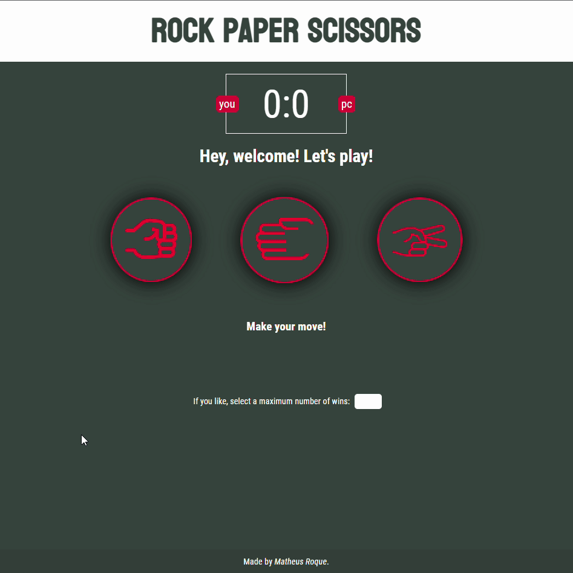

# rock-paper-scissors-game
A well known rock paper scissors game written with JavaScript. It utilizes Math.random() to get a choice from the "computer" who the user plays against. The result of each round is displayed both in numbers and in a paragraph. The user also has the option to set a maximum number of rounds.
  

